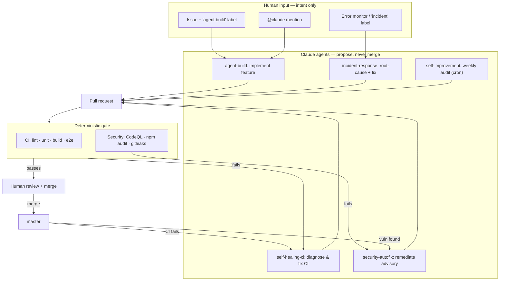

# Weather You Travel — a repository that builds, fixes, and secures itself

[](https://github.com/nonokia/weather-you-travel/actions/workflows/ci.yml)
[](https://github.com/nonokia/weather-you-travel/actions/workflows/security-scan.yml)

This repository is a **portfolio demonstration of an AI-operated software
lifecycle**. The product — a small React app that turns a flight number into the
weather at your destination for your travel dates — is real and works. But the
product is the *substrate*. The thing being showcased is the **autonomous
system wrapped around it**: a set of GitHub Actions workflows where AI agents
(Claude) design features, repair broken CI, remediate security findings, and
respond to production incidents — while a human approves every merge.

> **The premise:** humans file *intent*. The system produces *code, tests,
> fixes, and security patches*. Nothing reaches `master` without passing a
> deterministic quality gate and a human review.

---

## The autonomous loop



Two feedback edges make it a *loop*, not a pipeline: a failing CI run on
`master` triggers the self-healing agent, and a failing security scan triggers
the remediation agent. The system reacts to its own state.

---

## What each workflow does

| Workflow | Trigger | What the agent does |
|---|---|---|
| [`ci.yml`](.github/workflows/ci.yml) | push / PR | The quality gate: lint, unit tests, build, Playwright E2E. *(no AI — this is the contract everything else is judged against)* |
| [`claude.yml`](.github/workflows/claude.yml) | `@claude` mention | Interactive assistant on issues & PRs |
| [`pr-review.yml`](.github/workflows/pr-review.yml) | PR opened/reopened | Read-only agent review: correctness, security, test gaps (inline comments) |
| [`self-healing-ci.yml`](.github/workflows/self-healing-ci.yml) | CI fails on `master` | Reads the failing logs, finds the root cause, opens a fix PR |
| [`agent-build.yml`](.github/workflows/agent-build.yml) | issue labeled `agent:build` | Designs + implements the request with tests, opens a PR |
| [`self-improvement.yml`](.github/workflows/self-improvement.yml) | weekly cron | Audits the codebase, opens **one** focused improvement PR |
| [`security-scan.yml`](.github/workflows/security-scan.yml) | push / PR / daily | CodeQL, `npm audit`, gitleaks secret scan, dependency review |
| [`security-autofix.yml`](.github/workflows/security-autofix.yml) | security scan fails | Triages the finding, opens a remediation PR (flags secrets for rotation) |
| [`incident-response.yml`](.github/workflows/incident-response.yml) | `repository_dispatch` or `incident` label | Root-cause analysis on a runtime error → fix + regression test PR |

The rules every agent operates under live in
[`.github/AGENT_GUARDRAILS.md`](.github/AGENT_GUARDRAILS.md). The design
rationale — *why* it's safe to let agents do this — and full setup instructions
are in [`docs/AUTONOMOUS_SYSTEM.md`](docs/AUTONOMOUS_SYSTEM.md). A running log of
what the agents have actually shipped is in
[`docs/CASE_STUDIES/`](docs/CASE_STUDIES/).

---

## Why this is safe (the engineering, not the magic)

The hard part of "let AI maintain my repo" isn't getting an agent to write code
— it's making that **safe and reviewable**. The safeguards here are the point:

1. **Agents propose; humans dispose.** No agent can merge. Branch protection
   blocks direct pushes to `master`; every change is a PR.
2. **A real quality gate.** Before any of this was automated, the test suite was
   formalistic (one render assertion). Self-healing is meaningless if CI can't
   tell right from wrong, so the foundation work extracted pure, testable logic
   and added a real unit suite. **Tests-first is a prerequisite, not an
   afterthought.**
3. **Agents may never weaken tests to go green.** Encoded in the guardrails and
   repeated in every prompt: fix the source, never delete the test.
4. **Least privilege + scoped diffs.** Per-workflow `--max-turns` budgets,
   minimal-diff instructions, and an explicit "never touch" list.
5. **Untrusted input is handled as untrusted.** E.g. incident payloads are
   passed via `env`, never interpolated into a shell — see the
   [hardening note](.github/workflows/incident-response.yml).

---

## Try it (as a reviewer)

Once the repository is configured (see
[setup](docs/AUTONOMOUS_SYSTEM.md#setup)):

- **Build a feature:** open an issue describing it, add the `agent:build` label,
  watch a PR appear.
- **Watch it self-heal:** merge a PR that breaks a test → CI goes red →
  `self-healing-ci` opens a fix.
- **Ask a question:** comment `@claude how does the weather aggregation work?`
  on any issue or PR.

---

## The product underneath

<details>
<summary>About the Weather You Travel app itself</summary>

A React 19 + Vite app. Enter a departure (and optional return) flight number; it
looks up the route and shows the destination weather for the travel dates.

```bash
npm install
npm run dev          # http://localhost:5173
npm run lint
npm run test:run     # unit (Vitest) — CI mode
npm run test:e2e     # E2E (Playwright)
npm run build
```

- **Data layer** (`src/services/api.js`): the single source of all fetching.
  Each call tries the real API when a key is present and falls back to in-file
  mock data otherwise, so the app runs with no keys. Pure transform helpers are
  extracted for testability.
- **State** lives in `src/App.jsx`; presentational components receive props.
- **i18n** (`src/i18n.js`): English/Japanese via i18next.

Architecture details for contributors (human or agent) are in
[`CLAUDE.md`](CLAUDE.md). An honest assessment of the app's commercial prospects
— and why this repo pivoted to being an automation demo — is in
[`BUSINESS_FEASIBILITY_REPORT.md`](BUSINESS_FEASIBILITY_REPORT.md).

</details>
